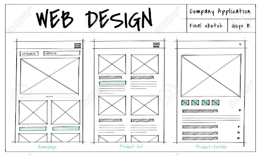
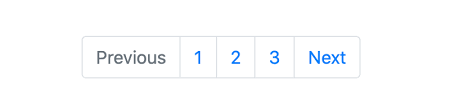
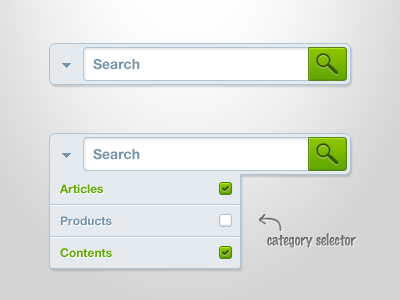

#### 1. Actividad Frontend

Se requiere una aplicación web que obtenga los datos en formato JSON proporcionados por la siguiente API REST gratuita:

[https://rickandmortyapi.com/](https://rickandmortyapi.com/)

La API REST contiene la información necesaria para hacer las peticiones y obtener la información.

Nota: El consumo de un servicio web nos permitirá conocer si usted está familiarizado con conceptos relacionados a servicios web (endpoint, rest api, métodos de petición HTTP)

Se requiere una GUI como se muestra a continuación:

Nota: La gama de colores, personalización y efectos de UX (user experience) se dejan a su discreción.

- La página inicial mostrará datos relevantes como el nombre y la imágen de los personajes.
- Se requiere una paginación en el footer de la página

- Además, una barra de navegación (header) con la posibi-lidad de buscar personajes (la función de mostrar las sugerencias queda a su discreción)

Nota: Esto nos permitirá conocer sus habilidades con respecto a la presentación y manejo de la información.

Adicionalmente, se requiere una página secundaría que indique a detalle las características o datos disponibles de un personaje específico.

Nota: La página secundaría nos permitirá conocer su habilidad para el manejo de rutas y parámetros.

Adicionalmente se requiere que la aplicación desarrollada sea adaptable a cualquier dispositivo. Es decir que posea un diseño responsive.

Nota: El diseño móvil se deja a su discreción. Sin embargo, la información debe poder ser visualizada de la mejor manera.

Una vez que haya finalizado el ejercicio, es necesario que esta aplicación se encuentre desplegada en algún proveedor de hosting gratuito (Ejemplo: Firebase, ZEIT Now, Netlify, Heroku, GitHub Pages, etc).

Nota: El enlace del hosting debe ser compartido con Eiteck. Esto nos permitirá conocer sus habilidades en cuanto al despliegue de sitios webs.

Hecho lo anterior, se requiere que este proyecto nos sea compartido mediante un repositorio de GitHub para su evaluación y verificar el correcto funcionamiento.

Nota: El enlace del repositorio de Github debe ser compartido con Eiteck. Esto nos permitirá conocer sus habilidades en cuanto al manejo de control de versiones con Git, y el trabajo colaborativo con código remoto.
